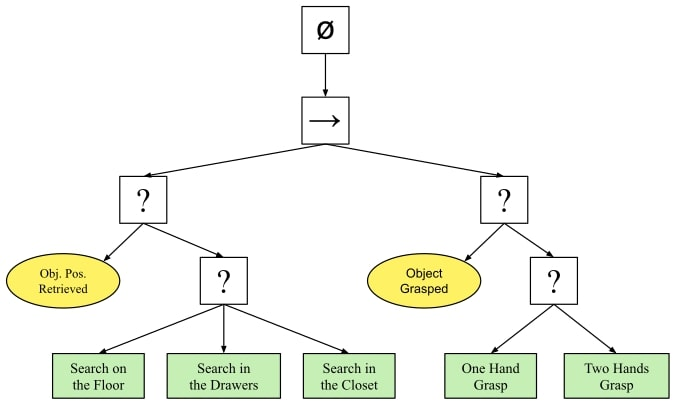
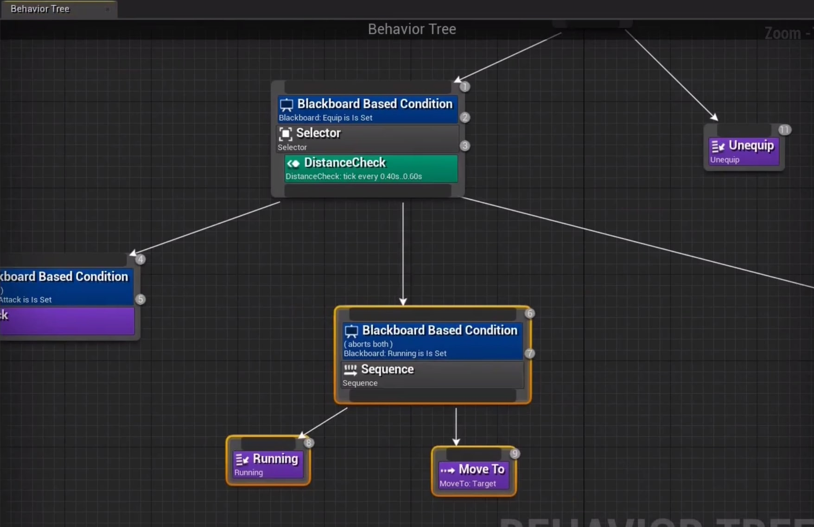
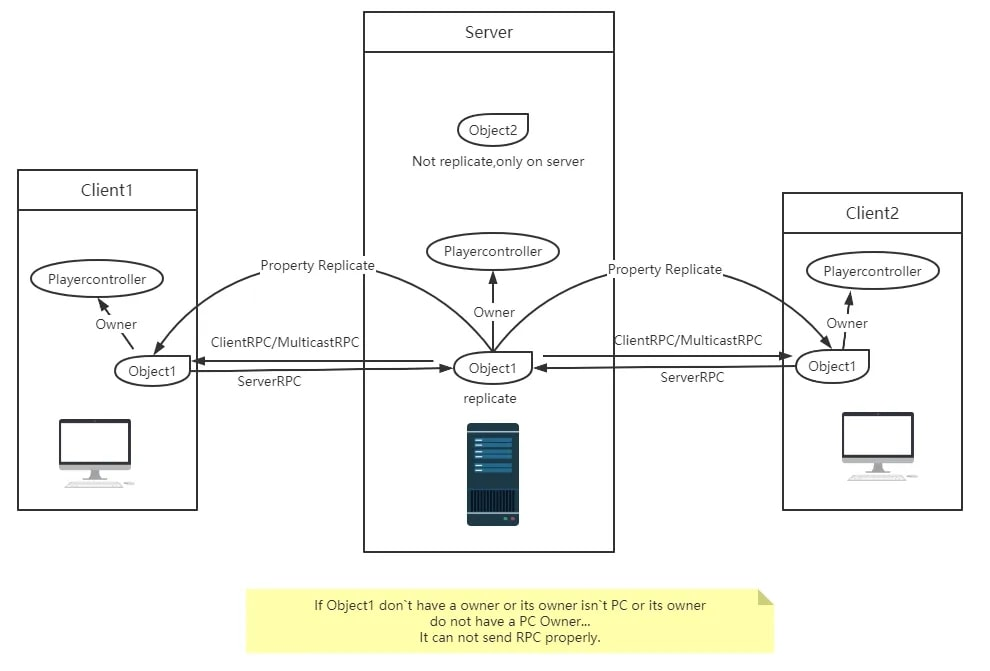

# Eric Xu Cui
Hi, everyone! Welcome to my personal site. My name is Eric Xu Cui,  I am majoring BS. Mathematics and Computer Science @McGill University. I have a strong obsession and passion for video game development and Artificial Intelligence. My aim is to forge connections between the realms of entertainment and AI by employing traditional programming algorithms and machine learning to deepen insights into both domains.

#### Technical Skills: Unreal Engine 4&5 game development by using C++ and Blueprint, Video Game AI Behavior Tree Design

**Email**:[ericxucui5@gmail.com](ericxucui5@gmail.com)

**LinkedIn**: [Eric Xu Cui ](https://www.linkedin.com/in/eric-xu-cui-209b57237/)

## Internship & Projects
### C++ Unreal Engine AI Behavior Tree Design Lecturer

    <video width="400" height="300" controls>
    <source src="Assets/CppAIProject.mp4" type="video/mp4">
    Your browser does not support the video tag.
    </video>

*All art resouces are legally purchased from the EPIC store.*

This lecture is about developing a basic AI behavior tree template that can be used to implement mainstream video games using **C++** and **Unreal Engine 4**. Inspired by **Sekiro: Shadows Die Twice** and the **Dark Souls Series**, this project incorporates various modern AI mechanisms such as attacking, dodging, strafe walking, and using multiple different ultimate skills against the player. It coordinates multiple AI features from Unreal Engine such as Blackboard, Decorators, Services, and Tasks. Additionally, there are separate English and Chinese versions of this lecture available (you may click the portal below to learn more). I am proud that hundreds of students worldwide have enrolled in my courses, pursuing their dreams of becoming video game programmers.

 

 <a href="https://www.yiihuu.com/a_11330.html" style="background-color: #202020; color: white; padding: 10px 20px; text-decoration: none; border-radius: 5px; font-size: 12px;">C++ Portal (Mandarin)</a>

 <a href="https://www.wingfox.com/c/8686_1895_15502" style="background-color: #202020; color: white; padding: 10px 20px; text-decoration: none; border-radius: 5px; font-size: 12px;">Blueprint  Portal (English)</a>
### C++ Unreal Engine RPC(Remote Call Procedure) Network Lecturer

    <video width="400" height="300" controls>
    <source src="Assets/CppRPC.mp4" type="video/mp4">
    Your browser does not support the video tag.
    </video>

*All art resouces are legally purchased from the EPIC store.*

This lecture is about developing a LAN-based FPS multiplayer shooting game template that can be used to implement on dedicate server using **C++** and **Unreal Engine 5**. The tutorial covers key topics such as the principles of LAN communication, Remote Procedure Call (RPC) feature, player character control, and game mode design. Through practical examples, you’ll gain a deep understanding of game architecture, data synchronization, LAN communication, etc.

 <a href="https://www.yiihuu.com/a_12508.html" style="background-color: #202020; color: white; padding: 10px 20px; text-decoration: none; border-radius: 5px; font-size: 12px;">C++ Portal (Mandarin)</a>

 <a href="https://github.com/EricXuCui/UE5-CPP-RPC-MultiplayerFPS-Development-Project" style="background-color: #202020; color: white; padding: 10px 20px; text-decoration: none; border-radius: 5px; font-size: 12px;">Visit Project Github</a>

### The Gyroscope-Powered Melee Project
In a world progressively driven by technology, gaming has become a cornerstone of entertainment. However, many traditional gaming platforms tend to be static in nature, lacking immersion and accessibility for a diverse range of players. Inspired by a desire to revolutionize the gaming industry. We developed a project by using **C++** on the **Unreal Engine 4 (UE4)** platform with **gyroscope technology (Motion Sensors, n.d.)** and **RPC feature (Remote Call Procedure)** at its core, the game's character movements are controlled. Through simple tilt or movement, players can execute slashes, stabs, blocks with shields, and more, with each action depleting energy reserves. This year, we participated in the BC Youth Innovation Showcase, and our project has advanced to the [semifinals](https://www.sciencefairs.ca/news/2023/semifinalists-for-the-fifth-annual-youth-innovatio/)! (you may click the portal below to learn more)

    <video width="350" height="250" controls>
    <source src="Assets/Gyroscope.mp4" type="video/mp4">
    Your browser does not support the video tag.
    </video>

*All art resouces are legally purchased from the EPIC store.*

 <a href="https://www.sciencefairs.ca/participate/yis/semifinalists/jason-eric-project/" style="background-color: #202020; color: white; padding: 10px 20px; text-decoration: none; border-radius: 5px; font-size: 12px;">Portal (English)</a>

 <a href="https://github.com/EricXuCui/Banneret-The-Gyroscope-Powered-Medieval-Combat-Project" style="background-color: #202020; color: white; padding: 10px 20px; text-decoration: none; border-radius: 5px; font-size: 12px;">Visit Project Github</a>
### Video Game Development Enginner
I am currently working as a junior video game engineer for a Chinese indie video game company called Tin Gameworks, and I do this job remotely. My main tasks involve creating the basic structure for the gameplay and developing artificial intelligence for in-game enemies. We're currently working on our project which is 'Shan Hai Myth: Train of Samsara,' and we aim to share a playable demo by the first quarter of next year.(you may click the portal below to learn more)

 <a href="http://tingameworks.com" style="background-color: #202020; color: white; padding: 10px 20px; text-decoration: none; border-radius: 5px; font-size: 12px;">Portal (Mandarin)</a>

 <a href="http://tingameworks.com/index.php?lang=en" style="background-color: #202020; color: white; padding: 10px 20px; text-decoration: none; border-radius: 5px; font-size: 12px;">Portal (English)</a>
