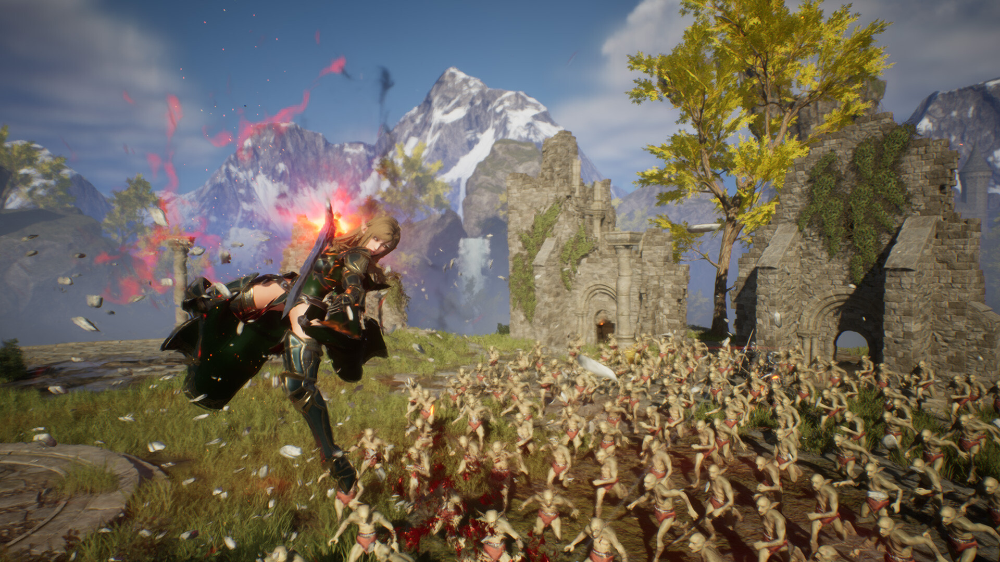
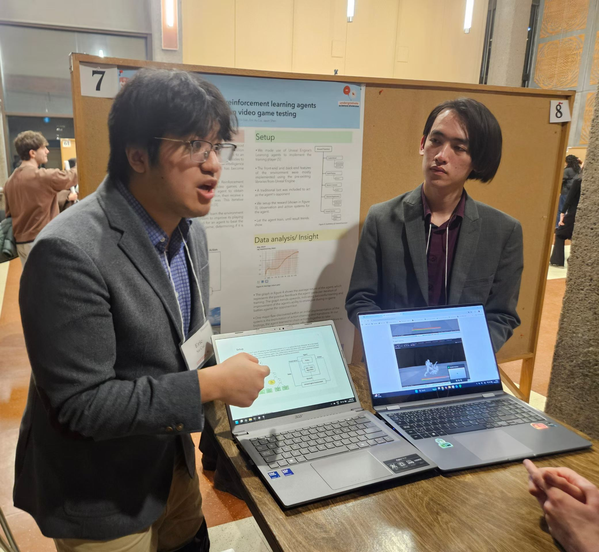
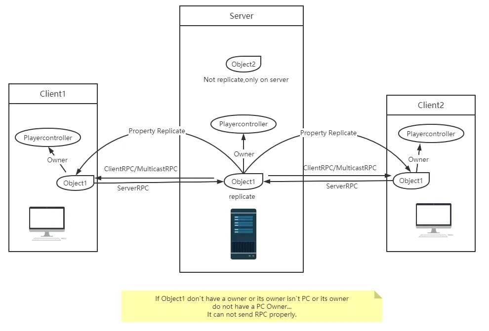
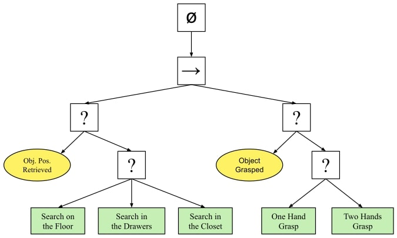
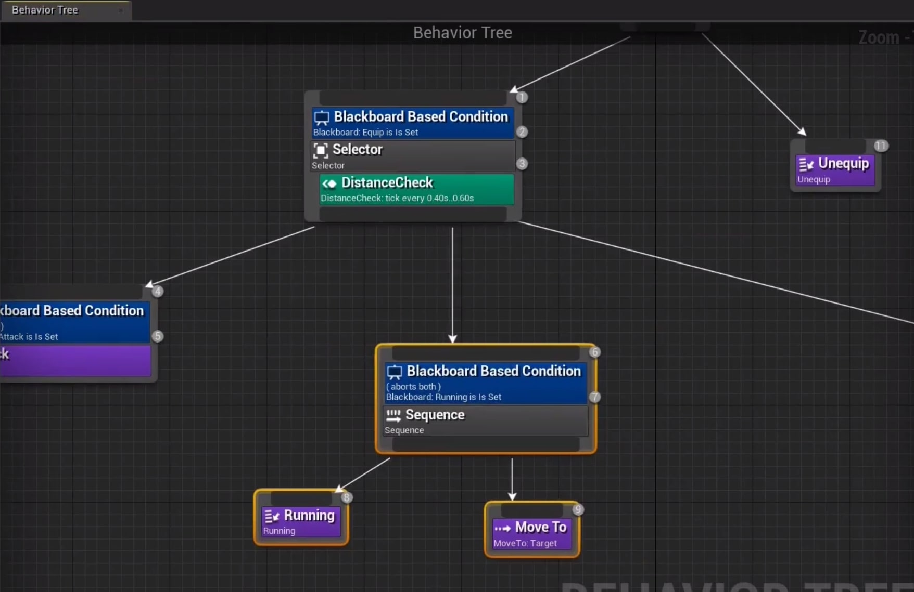

# Eric Xu Cui 崔旭

*Last Updated: August 2026*

Hi! I'm **Eric Xu Cui**, an undergraduate student studying **Computer Science** with a minor in **Mathematics** at **McGill University**.

I'm interested in **game development, game AI, and reinforcement learning**. Most of my recent work has focused on Unreal Engine, gameplay programming, and experimenting with learning-based agents in interactive environments.

I have worked on Unreal Engine projects through personal projects, teaching, academic showcases, and an industry internship.

---

## About

**Education:** McGill University — B.Sc. Computer Science, Minor in Mathematics

**Interests:** Game AI · Reinforcement Learning · Unreal Engine · Gameplay Programming

**Languages:** C++ · Python · Java

**Tools & Technologies:** Unreal Engine 4/5 · Blueprint · Behavior Trees · Multiplayer / RPC · Reinforcement Learning

**Email:** [ericxucui.work@gmail.com](mailto:ericxucui.work@gmail.com)

**LinkedIn:** [Eric Xu Cui](https://www.linkedin.com/in/eric-xu-cui-209b57237/)

**GitHub:** [EricXuCui](https://github.com/EricXuCui)

---

# Experience

## Unreal Engine Developer Intern — Taner Games

**Shanghai, China · Summer 2026**

During my internship at **Taner Games**, I worked on gameplay and AI-related features in Unreal Engine 5.

Some of the areas I contributed to include:

* Gameplay and NPC interaction systems
* Branching dialogue features
* Companion and NPC behavior
* Local multiplayer and split-screen features
* Platform adaptation and development support
* Reinforcement learning experiments in Unreal Engine

<!--
TODO: Add internship image.

Example:

    

-->

<!--
TODO: Add internship/demo video if appropriate.

    <video width="700" controls>
        <source src="Assets/TanerGamesDemo.mp4" type="video/mp4">
        Your browser does not support the video tag.
    </video>

-->

---

# Selected Projects

## Combat Learning Agent

**McGill Undergraduate Science Showcase**

This project explores the use of **reinforcement learning for video game combat AI**.

I built an Unreal Engine 5 environment where an agent observes the state of a combat encounter, selects actions, and receives rewards based on its interactions with an opponent.

The project was presented at the **McGill Undergraduate Science Showcase**.

**Technologies:** Unreal Engine 5 · C++ · Learning Agents · PPO · Reinforcement Learning

<!--
TODO: Add McGill Showcase photo.

    

-->

<!--
TODO: Add gameplay/training video.

    <video width="700" controls>
        <source src="Assets/CombatLearningAgent.mp4" type="video/mp4">
        Your browser does not support the video tag.
    </video>

-->

### Links

<a href="https://ericxucui.github.io/CombatLearningAgent/" style="background-color:#202020; color:white; padding:10px 20px; text-decoration:none; border-radius:5px; font-size:13px;">
Project Website
</a>

 

<a href="https://github.com/EricXuCui/CombatLearningAgent" style="background-color:#202020; color:white; padding:10px 20px; text-decoration:none; border-radius:5px; font-size:13px;">
Project GitHub
</a>

---

## Current Work — Decision Scheduling for RL Game Agents

I am currently extending the Combat Learning Agent project to explore how real-time reinforcement learning agents decide **when to make their next policy decision**.

Different gameplay actions have different durations. For example, a dodge, light attack, or heavy attack may require different amounts of time before another decision is meaningful.

I am experimenting with action-dependent decision timing and interruption-aware scheduling to study how these mechanisms affect agent behavior and training.

This work is currently in development.

<!--
TODO: Later you can add:
- Architecture diagram
- Experimental results
- Demo video
- Paper or project page
-->

---

## UE5 C++ RPC Multiplayer FPS

A multiplayer FPS project developed with **C++ and Unreal Engine 5** to study Unreal Engine networking and Remote Procedure Calls.

The project covers:

* Client-server communication
* Remote Procedure Calls
* Multiplayer character control
* Gameplay synchronization
* Game mode and multiplayer logic

    <video width="700" controls>
        <source src="Assets/CppRPC.mp4" type="video/mp4">
        Your browser does not support the video tag.
    </video>

    

### Links

<a href="https://www.yiihuu.com/a_12508.html" style="background-color:#202020; color:white; padding:10px 20px; text-decoration:none; border-radius:5px; font-size:13px;">
Course Portal
</a>

 

<a href="https://github.com/EricXuCui/UE5-CPP-RPC-MultiplayerFPS-Development-Project" style="background-color:#202020; color:white; padding:10px 20px; text-decoration:none; border-radius:5px; font-size:13px;">
Project GitHub
</a>

---

## Unreal Engine AI Behavior Tree Course

I developed a practical Unreal Engine course focused on implementing combat-oriented game AI using **C++ and Behavior Trees**.

The project includes examples of:

* Blackboard systems
* Behavior Trees
* Services
* Decorators
* Tasks
* Attacking
* Dodging
* Strafing
* Multiple combat abilities

The course is available in both Chinese and English versions.

    <video width="700" controls>
        <source src="Assets/CppAIProject.mp4" type="video/mp4">
        Your browser does not support the video tag.
    </video>

    
    

### Links

<a href="https://www.yiihuu.com/a_11330.html" style="background-color:#202020; color:white; padding:10px 20px; text-decoration:none; border-radius:5px; font-size:13px;">
C++ Course — Mandarin
</a>

 

<a href="https://www.wingfox.com/c/8686_1895_15502" style="background-color:#202020; color:white; padding:10px 20px; text-decoration:none; border-radius:5px; font-size:13px;">
Blueprint Course — English
</a>

---

## Motion-Controlled Medieval Combat System

This project explored motion-based interaction in Unreal Engine using **C++, motion sensors, and multiplayer networking**.

Player actions such as attacking and blocking can be controlled through physical device movement and orientation.

The project advanced to the **semifinals of the BC Youth Innovation Showcase**.

    <video width="700" controls>
        <source src="Assets/Gyroscope.mp4" type="video/mp4">
        Your browser does not support the video tag.
    </video>

### Links

<a href="https://www.youtube.com/watch?v=U2efF2xVEB4" style="background-color:#202020; color:white; padding:10px 20px; text-decoration:none; border-radius:5px; font-size:13px;">
Project Video
</a>

 

<a href="https://github.com/EricXuCui/Banneret-The-Gyroscope-Powered-Medieval-Combat-Project" style="background-color:#202020; color:white; padding:10px 20px; text-decoration:none; border-radius:5px; font-size:13px;">
Project GitHub
</a>

---

# Skills

### Programming

C++ · Python · Java

### Game Development

Unreal Engine 4/5 · Blueprint · Gameplay Programming · Multiplayer / RPC · Behavior Trees

### AI

Reinforcement Learning · PPO · Game AI

---

# Activities & Highlights

### McGill Undergraduate Science Showcase

Presented the **Combat Learning Agent** project exploring reinforcement learning in a real-time combat environment.

### BC Youth Innovation Showcase

Semifinalist for the **Motion-Controlled Medieval Combat System** project.

### Game Development Instructor

Developed Unreal Engine courses covering game AI, C++, Blueprint, and multiplayer programming.

---

# Contact

I'm happy to connect with people interested in **game development, Unreal Engine, game AI, reinforcement learning, or related projects**.

**Email:** [ericxucui.work@gmail.com](mailto:ericxucui.work@gmail.com)

**LinkedIn:** [Eric Xu Cui](https://www.linkedin.com/in/eric-xu-cui-209b57237/)

**GitHub:** [github.com/EricXuCui](https://github.com/EricXuCui)

---

*© 2026 Eric Xu Cui. All Rights Reserved.*
